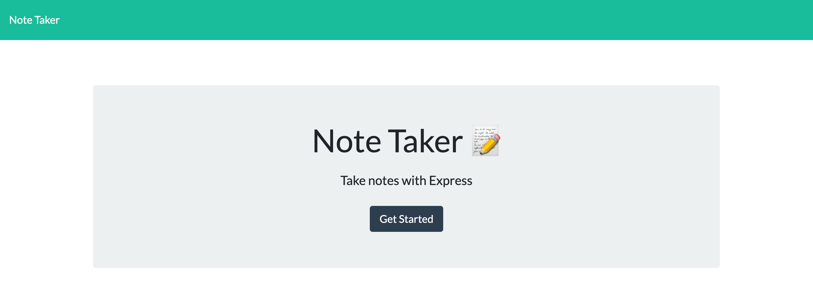

# Note Taker

An application to write notes with Express.js backend.

---

[GitHub](https://github.com/705h-S/Note-Taker)

[Deployed app](https://gentle-brushlands-92178.herokuapp.com/)

---

## Technologies Use

- [Node.js](https://nodejs.org/)
- [NPM](https://www.npmjs.com/)
- [Express](https://www.npmjs.com/package/express)
- [Bootstrap](https://getbootstrap.com/)
- [Heroku](https://devcenter.heroku.com/)

---

## Usage

- Application will allow user to be able to add note's title and description
- Application will allow user to be able to save the notes and won't lose them even they refresh the page

---

## Screenshots




```javascript
eRoute.get("/notes", (req, res) => {
  res.sendFile(path.join(__dirname, "../public/notes.html"));
});
```

> How I linked the notes route to homepage

---

## Contributor

[Joshua Meza](https://705h-s.github.io/portfolio-charlie/)

---
